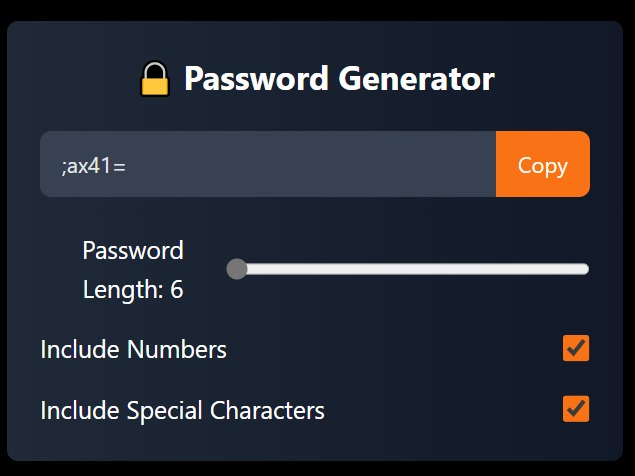

 # Password Generator 🔐✨

This is a simple Password Generator application built using React.js. It allows you to generate a password of a specified length with options to include numbers 🔢 and special characters 🔣.



## 🚀 Features

- 🔑 **Generate random passwords.**
- 🔄 **Adjustable password length** (6 to 100 characters).
- 🔢 **Option to include numbers.**
- 🔣 **Option to include special characters.**
- 📋 **Copy generated password** with a single click.

## 🎯 Demo

🔍 **Live preview of the app:** *(Demo section to show your app in action.)*

## 🛠️ Usage

To use this Password Generator, follow these steps:

1. 🎚️ Adjust the **slider** to choose your desired password length.
2. ✅ Check or uncheck the options for **including numbers** and **special characters**.
3. 📋 Click the **"Copy" button** to copy the generated password to your clipboard.

## 📦 Installation

1. 🖥️ Clone the repository:
   ```bash
   git clone https://github.com/yourusername/password-generator.git
